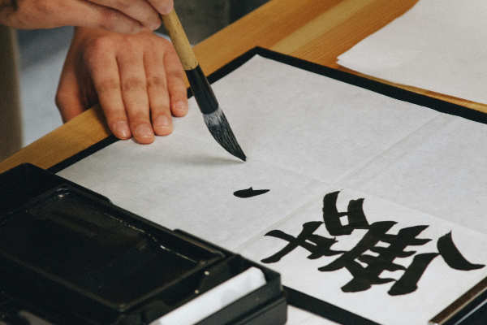

# Text Formatting



Markdown is a lightweight markup language used to format plain text. Here’s how to use its essential syntax.

---

## 1. Headings

Use `#` for headings. The number of `#` symbols determines the level:

```markdown
# Heading 1
## Heading 2
### Heading 3
#### Heading 4
##### Heading 5
###### Heading 6
```

## 2. Bold and Italics

```markdown
Bold: **text** or __text__
Italic: *text* or _text_
Bold and Italic: ***text*** or ___text___
```

This is **bold**.
This is _italic_.
This is ***bold and italic***.

## 3. Blockquotes

Use '>' to create blockquotes:

```markdown
> This is a blockquote.
```

> This is a blockquote.

## 4. Horizontal Rules

To create a horizontal rule, use three or more asterisks (***), dashes (---), or underscores (___) on a line by themselves.

```markdown
***
---
___
```

---

**[Previous: Customize the Footer](/posts/change-footer/)** | **[Next: Markdown Basics - List, Links and Images](/posts/markdown-basic2/)**
